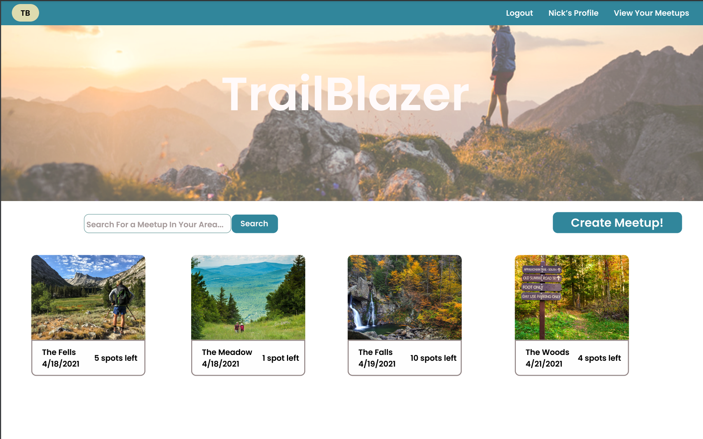

# Trailblazer


[Backend Repo](https://github.com/nicholascrandall/Trailblazer_API)

[Heroku Deployment](https://trailblazers-app.herokuapp.com/event)

Trailblazer is a Full Stack Web Application that provides users with all the information they need to plan out their perfect day in the woods!

## MVP
This app will allow you to:
- Login/Logout to your account
- Create a new trip 
     - you can provide details around your trip including what to bring, how many people can sign up, where it starts, what kind of activity it is for and when, and a difficulty rating
- Other users can search for trips in their area 
- Users can sign up for another's users trip by entering their email address
- You should be able to cancel your trip or delete your trip 
- You should be able to edit details about the trip 
- people should be able to comment on the trip page 
- As a user i would want to see a view of my upcoming trips and past trips

# Stretch Goals 
- use multer to allow users to upload (multiple) photos to the meetup page 
- There should be a weather API integration that lets users know what the weather will be like on the day of the trip 
- there should be a google maps api integration that show where the meet up spot is 
- Users have a profile page that they can upload photos to, store information on etc
- Give users access to a trail page for all of the trails (or parks) in their area that is searchable where they can review the trail or start a meetup 

## Data Model
Users Model
```
{
    username: {unique:true, required:true, type: String},
    password: {required:true, type: String},
    fullname: {type:String, default: "Anonymous Hiker"},
    avatar: {type:String, default: "some.link.here"} 
    about: String
}
```

Event Model 
```
    {
        lat: Number,
        long: Number,
        date: Date,
        creator: String, 
        maxAttendees: Number,
        attendees: Array, 
        details:{
            difficulty: Number, 
            activityType: String,
            supplies: Array
            },
        img: String,
        comments: [String],
        }
    }
```

Comments/Review Model
```
    {
        username: String,
        time: {type:Timestamp, default: date.now}, 
        content: String,
        rating: Number,

    }
```

Trail Model
```
    {
        name: {required:true, type: String}, 
        reviews:Array,
        location: {
            lat: Number,
            lon: Number
        },
        city: String, 
        state: String
    }
```
